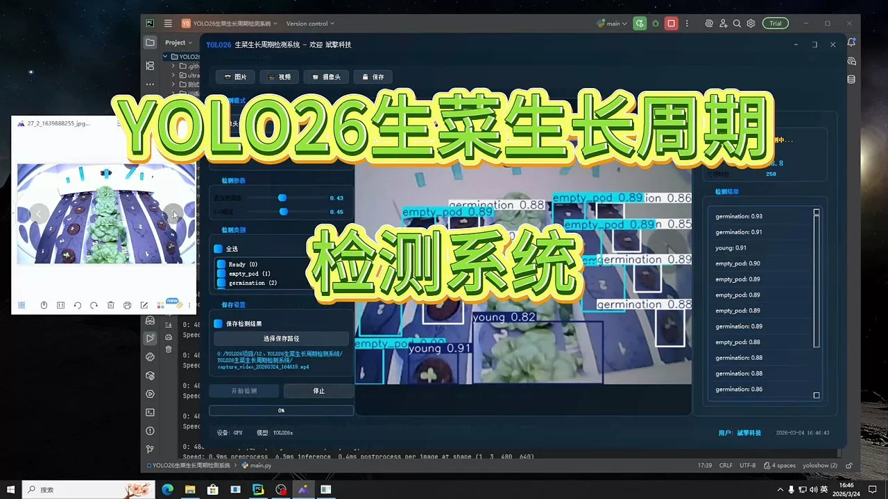
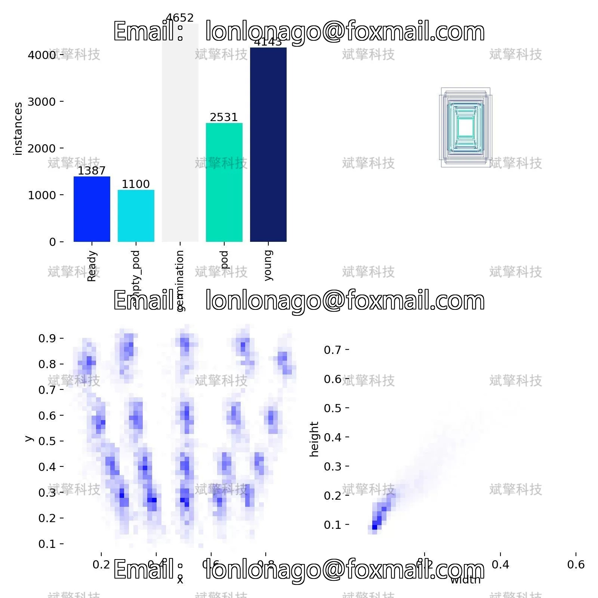
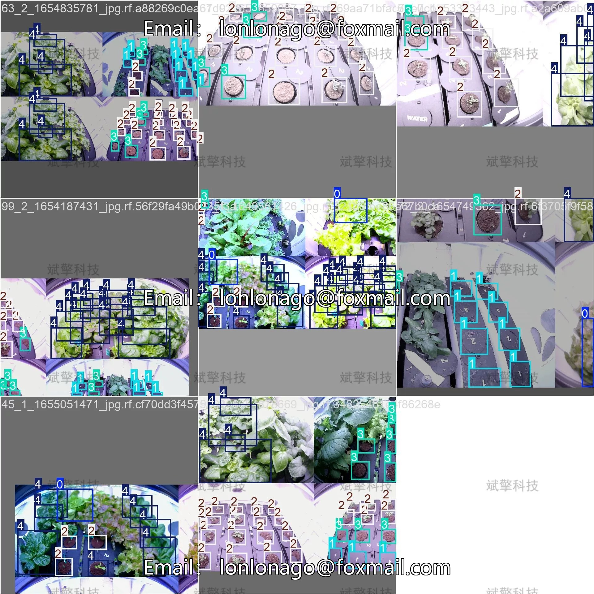
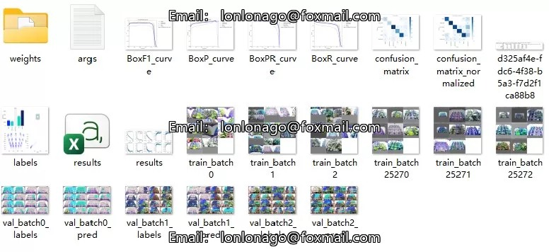
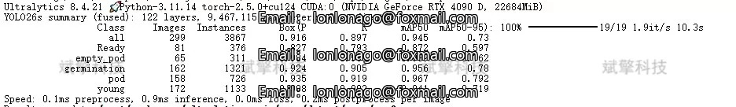
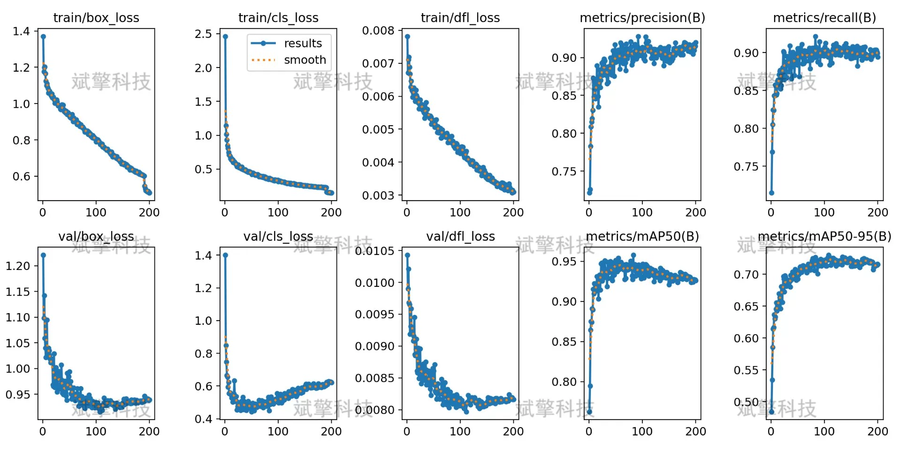
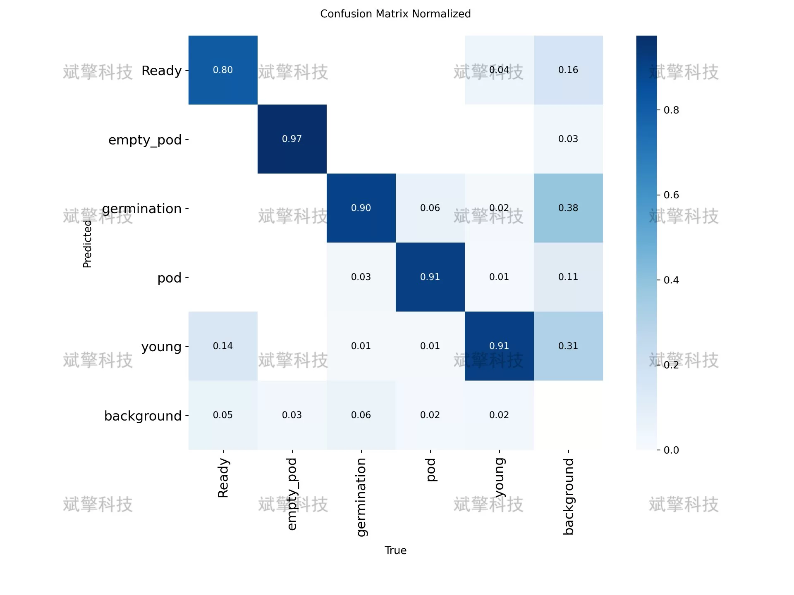
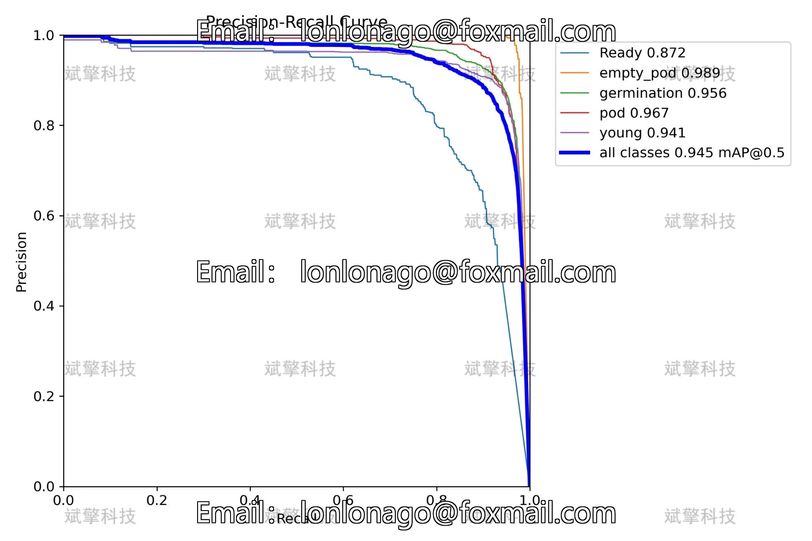
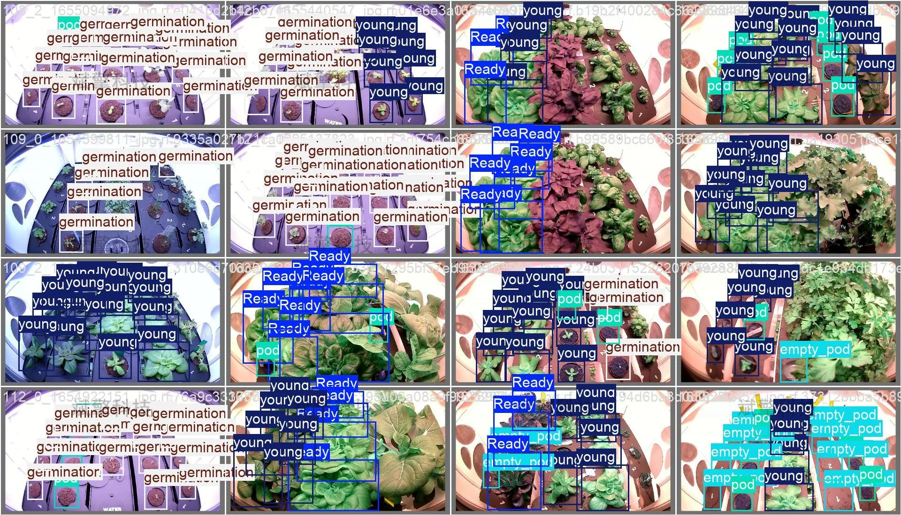

# YOLOv26 Tomato Growth Cycle Detection System | Source Code

## Body

YOLO26 Scallop Growth Cycle Detection System | Source Code for High Precision Scallop Growth Stage Identification: Implementation and Evaluation of YOLO26s in Five Cycle Detection Categories

The precise identification of the growth cycle of scallops is a key component in intelligent agricultural planting management, which is of great significance for optimizing irrigation, fertilization, and harvesting decisions. This study builds an automatic detection system for the growth cycle of scallops based on the YOLOv26s object detection algorithm. The dataset includes five growth stage categories: Ready (ripe), empty pod, germination, pod, and young (young seedling stage), totaling 1510 labeled images, including 1060 training sets, 299 validation sets, and 151 test sets. The experimental results show that the model achieved an average precision (mAP50) of 94.5% on the validation set, with detection accuracies exceeding 95% for empty pod, pod, and germination categories. However, the Ready category has certain confusion due to its visual features similar to the Young category, resulting in a relatively low detection accuracy (87.2%). The confusion matrix analysis shows that about 14% of samples in the Ready category were misclassified as Young. This study verifies the effectiveness of YOLO26 in the detection of scallop growth cycle, providing technical support for the development of subsequent intelligent agricultural management systems.
Training Set: 1060 images (about 70%)
Validation Set: 299 images (about 20%)
Test Set: 151 images (about 10%)
Germination    Stage from seed sprouting to cotyledon unfolding
Young    Stage of rapid plant growth with true leaves
Pod    Stage of forming flower buds or pod structures
Empty_pod    Stage of developing pod but internals not fully filled
Ready    Stage of reaching harvest standards

Free appointment for remote installation. Unsuccessful full refund.
Purchase Enjoy the following resources (auto-unlocked in Baidu Cloud):
     YOLO recognition detection project complete source code
     Yolov2 format dataset
     Programming code + UI interface code
     Model after training + result images
     Software installer package
     Add WeChat to make an appointment for remote installation (automatically displayed WeChat ID after purchase) - Unsuccessful, full refund

⚙️ Core Functional Modules
Detection Capability
   Image Detection: Upon upload, return detection boxes + category information
    Video Detection: Supports video files, analyzes frames accurately
    Real-time Camera Detection: Connects to USB camera, achieves dynamic monitoring
Interaction and Control
    Target Selection: Choose one or more categories for detection
    Parameter Real-Time Adjustment: Adjustable confidence threshold & IoU threshold, flexibly control accuracy
    Result Save: One-click save of image/video/camera detection results
System and Data
    User login registration: Supports password strength check + encryption storage
    Log recording: Auto-record operation and error information (timestamped)

## Images

## Payment

Here is a pay link on Stripe ( https://buy.stripe.com/3cs8yP7sY87d0vu9AB ). Please contact me lonlonago@foxmail.com after funding $89, and I will send you a complete data files , thank you!

